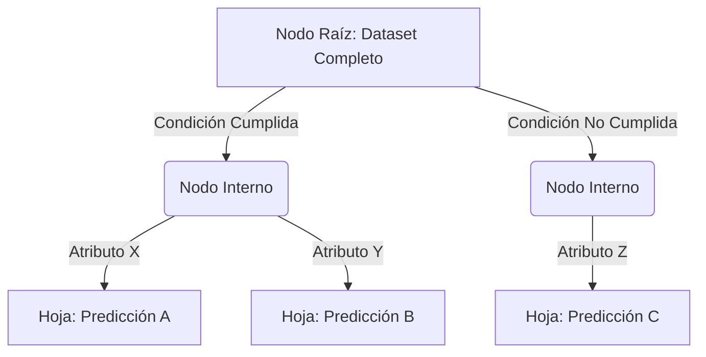
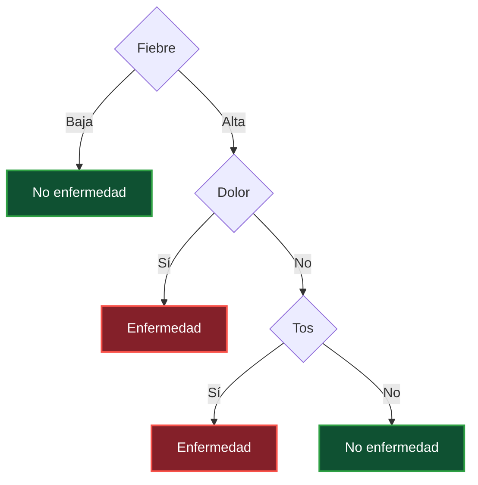

# 1. Propósito del Modelo en el Sistema de Soporte a la Decisión (DSS)

Este módulo lógico está diseñado para asistir a los directivos en la estructuración y resolución de problemas bajo condiciones de incertidumbre y riesgo (Turban et al., 2005). Para lograr esto de forma objetiva, el núcleo del sistema implementa un árbol de decisión, el cual se define como un modelo supervisado de aprendizaje automático que divide un conjunto de datos en subconjuntos más pequeños mediante reglas de decisión basadas en atributos, iterando hasta llegar a una predicción final en una hoja.

A diferencia de los enfoques heurísticos tradicionales donde el decisor debe calcular el Valor Monetario Esperado asignando probabilidades de forma subjetiva, este algoritmo automatiza la reducción de la incertidumbre. Según la documentación técnica del proyecto, el modelo de árbol de decisión "no necesita axiomas", "reglas explícitas" ni "conocimiento experto", debido a que "es puramente basado en datos" históricos.

La implementación de este modelo algorítmico en nuestro DSS se justifica operativamente porque proporciona una alta "interpretabilidad". Al generar un "modelo explicable", permite al tomador de decisiones auditar la ruta lógica que el sistema tomó, ya sea para predecir una clase categórica (clasificación) o un valor continuo (regresión).

---

# 2. Anatomía Conceptual del Árbol de Decisión

### ¿Qué es un Árbol de Decisión?

Un árbol de decisión es un algoritmo de aprendizaje supervisado no paramétrico, que se utiliza tanto para tareas de clasificación como de regresión. Tiene una estructura jerárquica de árbol, que consta de un nodo raíz, ramas, nodos internos y nodos hoja (Kavlakoglu, 2025).

### Estructura

Para estructurar el problema de negocio, el motor lógico construye una representación explícita en forma de árbol. Formalmente, esta es una estructura jerárquica compuesta por los siguientes elementos:

Nodo Raíz: Representa la primera decisión a tomar y evalúa el atributo inicial más importante.

Nodos Internos: Representan pruebas o condiciones sobre atributos específicos (por ejemplo, evaluar si el "Ingreso" es "Alto", "Medio" o "Bajo").

Ramas: Indican el resultado lógico de una prueba, guiando el flujo hacia el siguiente nivel del árbol.

Hojas (Nodos Terminales): Representan el resultado final, la predicción o clase definitiva alcanzada por el sistema.

## 2.1. El Flujo Determinístico del Modelo

A diferencia de un modelo probabilístico puro que podría dejar margen a la ambigüedad en su ejecución, el flujo de este Sistema de Soporte a la Decisión es altamente estructurado. Según la documentación técnica del algoritmo, "un árbol de decisión no 'elige una hoja' arbitrariamente".

El proceso de decisión sigue un flujo estrictamente determinístico:

Se toma el dato de entrada (el perfil del nuevo caso a evaluar).

Se evalúa la condición matemática o categórica del nodo raíz.

Según el resultado arrojado (ya sea verdadero/falso o una categoría específica), el sistema sigue la rama correspondiente.

Se repite el proceso transitando por los nodos internos hasta llegar a una hoja.

La hoja alcanzada dicta la predicción o recomendación final que se entregará al directivo.

---

# 3. El Motor Algorítmico: Partición Recursiva de Arriba hacia Abajo

El núcleo de este Sistema de Soporte a la Decisión (DSS) no adivina ni memoriza reglas humanas explícitas ; en su lugar, extrae patrones estadísticos directamente de los datos históricos. Matemáticamente, el funcionamiento interno de este modelo se define como una partición recursiva del espacio de características.

Durante la fase de entrenamiento, el algoritmo tiene la tarea de elegir la pregunta o condición que mejor separe los datos en cada nivel del árbol. Para lograrlo sin intervención humana, el sistema ejecuta de manera automatizada el siguiente proceso formal de construcción:

1. **Evaluación exhaustiva:** El algoritmo toma el conjunto de datos actual y procede a evaluar todas las divisiones posibles probando cada uno de los atributos disponibles.

2. **Cálculo de impureza:** Por cada división tentativa, el sistema calcula métricas estadísticas de impureza para medir qué tan mezcladas quedarían las clases si se hiciera ese corte.

3. **Selección óptima:** El modelo compara los resultados y procede a elegir la mejor división. El criterio matemático siempre será seleccionar el corte que reduzca más la impureza y separe mejor las clases.

4. **Partición:** Una vez encontrada la condición óptima, procede a dividir el dataset en subconjuntos más puros.

## 3.1. Recursividad y Condiciones de Parada

Este proceso de evaluación y división matemática no ocurre una sola vez, sino que se repite recursivamente en cada nueva rama generada. El ciclo de partición continúa hasta que el algoritmo choca con una "Condición de parada" predefinida en la configuración del modelo.

Las condiciones que detienen la recursividad para crear una hoja final (predicción) son:

- Que el nodo sea completamente puro (impureza suficientemente baja o igual a cero).

- Que se haya alcanzado la profundidad máxima permitida para el árbol (`max_depth`).

- Que se haya llegado al número mínimo de muestras requerido para seguir dividiendo (`min_samples_split` o `min_samples_leaf`).

- Que ya no exista una mejora significativa en la reducción de la incertidumbre al intentar dividir de nuevo.

---

# 4. Modelos Matemáticos de Evaluación de Riesgo (El "Cerebro")

Para que el algoritmo de partición recursiva pueda decidir qué pregunta hacer durante la fase de entrenamiento, el modelo "elige la pregunta que mejor separa los datos". Para lograr esto con precisión matemática, utiliza métricas que evalúan el nivel de desorden o incertidumbre en cada paso.

El sistema ha sido programado para permitirle al directivo parametrizar el modelo utilizando dos criterios matemáticos de evaluación:

## 4.1. Índice de Impureza de Gini (Enfoque Estadístico)

El Índice Gini es una métrica probabilística que calcula el riesgo estadístico de clasificar incorrectamente un elemento nuevo. El modelo busca la división que "reduzca más la impureza" y "separe mejor las clases".

- **Fórmula Matemática:**
  $$Gini = 1 - \sum p_{i}^{2}$$
  _(Donde $p_{i}$ representa la proporción o probabilidad de cada clase en un nodo específico)._

**Ejemplo Aplicado a la Reducción de Riesgo (Diagnóstico Médico):**
Para demostrar el funcionamiento de esta métrica, analicemos el cálculo inicial de incertidumbre en el nodo raíz de nuestro modelo. Supongamos un conjunto histórico de 8 pacientes, donde 3 tienen la enfermedad ("Sí") y 5 no la tienen ("No").

1. Se determinan las proporciones iniciales: $p_{Si} = \frac{3}{8}$ y $p_{No} = \frac{5}{8}$.
2. Se aplica la fórmula de Gini para el nodo raíz:
   $$Gini = 1 - \left( \left(\frac{3}{8}\right)^{2} + \left(\frac{5}{8}\right)^{2} \right)$$
   $$Gini = 1 - \left( \frac{9}{64} + \frac{25}{64} \right)$$
   $$Gini = 1 - \frac{34}{64} = 0.46875$$

Un índice inicial de **0.46875** indica que existe incertidumbre (mezcla de clases) en el nodo. A partir de este punto, el algoritmo prueba dividir los datos usando diferentes atributos (como "Fiebre" o "Tos") y calcula el _Gini ponderado_ de las nuevas ramas. El sistema ejecutará automáticamente la división que arroje el valor Gini más cercano a **0** (pureza máxima).

## 4.2. Entropía y Ganancia de Información (Teoría de la Información)

Como criterio algorítmico alternativo, el sistema puede emplear la **Entropía**. Mientras que el Gini es una medida de probabilidad de error, la Entropía mide la cantidad de información necesaria para describir el nivel de "caos" en los datos.

- **Fórmula Matemática:**
  $$Entropia = -\sum p_{i}\log_{2}(p_{i})$$

Cuando el usuario selecciona este criterio, la "lógica interna cambia" hacia la Teoría de la Información, pero el "proceso estructural es el mismo". El algoritmo priorizará las divisiones que generen la mayor **Ganancia de Información**; es decir, evaluará qué pregunta logra reducir más matemáticamente el nivel de Entropía entre el nodo padre y los nodos hijos.

---

# 5. Interpretación de Resultados Gerenciales

El objetivo final de este Sistema de Soporte a la Decisión (DSS) no es reemplazar el juicio del directivo con una "caja negra" que arroje respuestas absolutas, sino dotarlo de un panorama probabilístico fundamentado en datos.

Una vez que el algoritmo de partición recursiva procesa el perfil de un nuevo caso (por ejemplo, un nuevo paciente o una nueva solicitud de crédito) y transita por los nodos internos hasta alcanzar una hoja final, el sistema genera dos tipos de salidas para la interpretación gerencial:

1. **Predicción de Clase (`predict`):** El sistema devuelve la clase mayoritaria presente en la hoja alcanzada. Esta es la recomendación directa del sistema (ej. "Enfermedad" o "No Enfermedad").
2. **Distribución Probabilística (`predict_proba`):** Este es el verdadero valor agregado para la toma de decisiones bajo riesgo. El sistema calcula y devuelve la proporción exacta de las clases que terminaron en esa hoja específica durante el entrenamiento.

**Ejemplo de Interpretación:**
Supongamos que el DSS arroja el siguiente resultado para un nuevo caso evaluado:

- **Predicción:** Enfermedad
- **Probabilidades:** `[0.25, 0.75]`

A nivel gerencial, esto significa que de todos los datos históricos que compartían el mismo perfil y terminaron en esa misma hoja lógica, el **75%** resultaron positivos a la enfermedad, mientras que el **25%** resultaron negativos.

Si el árbol se configura sin límite de profundidad (`max_depth=None`), las hojas resultantes serán estadísticamente puras, arrojando probabilidades absolutas de **0.0** o **1.0** (0% o 100%). Sin embargo, en escenarios reales donde se aplica una "poda" (regularización) para evitar el sobreajuste del modelo, estas probabilidades le permiten al directivo conocer el margen de error estadístico y decidir si asume o rechaza el riesgo asociado a la predicción.

---

# Referencias Bibliográficas

1. **Documento Interno del Equipo.** _Árbol de Decisión - Introducción_. (Base conceptual del modelo, proceso formal de construcción recursiva, fórmulas de impureza Gini, Entropía e interpretación de resultados de la librería Scikit-Learn).
2. **Breiman, L., Friedman, J., Stone, C. J., & Olshen, R. A. (1984).** _Classification and Regression Trees_. Taylor & Francis. (Fundamentación matemática del algoritmo CART, partición recursiva y uso del Índice Gini).
3. **Shannon, C. E. (1948).** _A Mathematical Theory of Communication_. The Bell System Technical Journal, 27(3), 379-423. (Bases formales para el cálculo de la Entropía y la Ganancia de Información).
4. **Turban, E., Aronson, J. E., & Liang, T. P. (2005).** _Decision Support Systems and Intelligent Systems_ (7th ed.). Prentice-Hall. (Fundamento gerencial sobre el análisis de toma de decisiones bajo riesgo y modelos normativos de los DSS).

5 **Kavlakoglu, E. (2025, 27 noviembre).** _Árboles de decisiones. IBM._ https://www.ibm.com/es-es/think/topics/decision-trees

---
