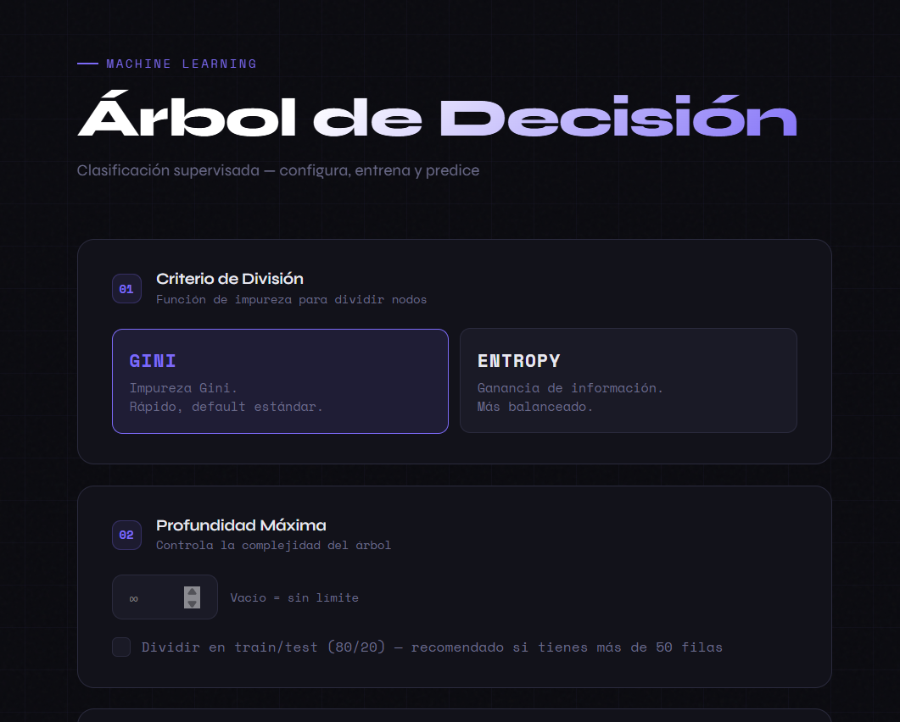
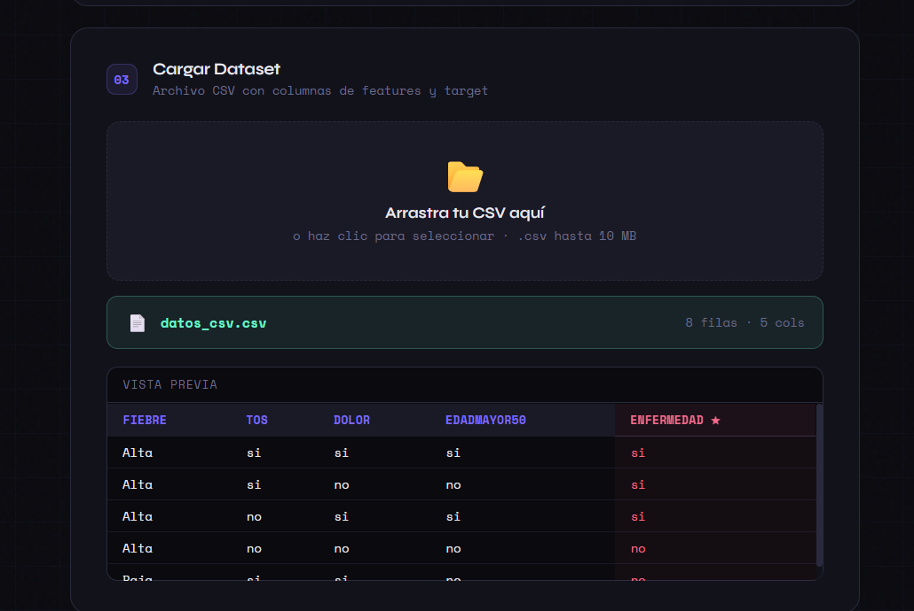
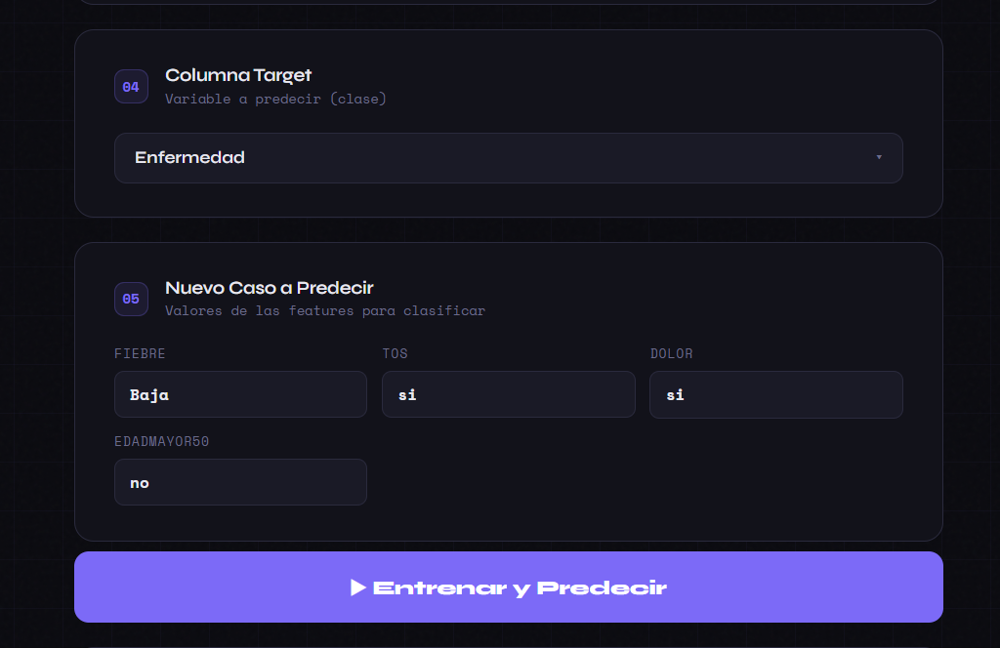
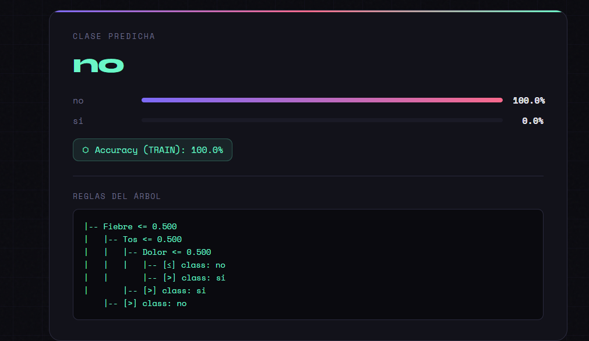

# Manual de Usuario

## Sistema de Soporte a la Decisión - Árbol de Decisión

### Unidad 1: Modelo de Decisión

---

## INSTRUCCIONES RÁPIDAS DE EJECUCIÓN

> Esta sección resume cómo ejecutar el programa y muestra los datos de ejemplo utilizados para probarlo.

### Forma 1 — Interfaz Gráfica (front.html) *(RECOMENDADA)*

1. Abre el archivo `front.html` directamente en tu navegador (doble clic o arrástralo).
2. Selecciona el **Criterio de División** (Gini o Entropy).
3. Ajusta la **Profundidad Máxima** si lo deseas.
4. Arrastra o selecciona el archivo `datos_csv.csv`.
5. Elige la **Columna Target** (`Enfermedad`).
6. Rellena los campos del **Nuevo Caso a Predecir**.
7. Haz clic en **▶ Entrenar y Predecir**.




### Forma 2 — Script de Python (consola/terminal)

```bash
# 1. Instalar dependencias (solo la primera vez)
pip install pandas scikit-learn matplotlib

# 2. Navegar a la carpeta del proyecto
cd "C:\Users\rodri\OneDrive\Desktop\Ad\ito-dstd-u1-modelo-decision"

# 3. Ejecutar el programa
python arbolDecision.py
```

Al ejecutarse, el programa hará dos preguntas en consola:

```
Seleccione el criterio de decision (gini / entropy): gini
Ingrese la profundidad maxima del arbol (Enter para sin limite): [Enter]
```

---

###  Datos de entrada utilizados para la prueba

El dataset de ejemplo (`datos_csv.csv`) contiene **8 pacientes** con 4 síntomas y un resultado de diagnóstico:

| Fiebre | Tos | Dolor | EdadMayor50 | Enfermedad *(target)* |
|--------|-----|-------|-------------|----------------------|
| Alta   | si  | si    | si          | **si**               |
| Alta   | si  | no    | no          | **si**               |
| Alta   | no  | si    | si          | **si**               |
| Alta   | no  | no    | no          | **no**               |
| Baja   | si  | si    | no          | **no**               |
| Baja   | si  | no    | si          | **no**               |
| Baja   | no  | si    | no          | **no**               |
| Baja   | no  | no    | si          | **no**               |

**Nuevo caso de prueba utilizado:**

| Fiebre | Tos | Dolor | EdadMayor50 |
|--------|-----|-------|-------------|
| Baja   | si  | si    | no          |

**Resultado obtenido:** El árbol predice `no` (el paciente **no** tiene la enfermedad) con una confianza del **100%**.


---

---

## ÍNDICE

1.  [Introducción](#1-introducción)
2.  [Requisitos del Sistema](#2-requisitos-del-sistema)
3.  [Estructura del Proyecto](#3-estructura-del-proyecto)
4.  [Archivos del Proyecto](#4-archivos-del-proyecto)
5.  [¿Cómo Funciona el Sistema?](#5-cómo-funciona-el-sistema)
6.  [Cómo Ejecutar el Programa](#6-cómo-ejecutar-el-programa)
    - 6.1 [Interfaz Gráfica (front.html)](#61-interfaz-gráfica-fronthtml)
    - 6.2 [Script de Python (consola)](#62-script-de-python-consola)
7.  [Guía Paso a Paso — Interfaz front.html](#7-guía-paso-a-paso--interfaz-fronthtml)
    - 7.1 [Paso 1 – Criterio de División](#71-paso-1--criterio-de-división)
    - 7.2 [Paso 2 – Profundidad Máxima](#72-paso-2--profundidad-máxima)
    - 7.3 [Paso 3 – Cargar Dataset](#73-paso-3--cargar-dataset)
    - 7.4 [Paso 4 – Columna Target](#74-paso-4--columna-target)
    - 7.5 [Paso 5 – Nuevo Caso a Predecir](#75-paso-5--nuevo-caso-a-predecir)
    - 7.6 [Paso 6 – Entrenar y Predecir](#76-paso-6--entrenar-y-predecir)
    - 7.7 [Paso 7 – Interpretar Resultados](#77-paso-7--interpretar-resultados)
8.  [Guía Paso a Paso — Script Python (consola)](#8-guía-paso-a-paso--script-python-consola)
    - 8.1 [Paso 1 – Selección del Criterio de División](#81-paso-1--selección-del-criterio-de-división)
    - 8.2 [Paso 2 – Selección de la Profundidad Máxima del Árbol](#82-paso-2--selección-de-la-profundidad-máxima-del-árbol)
    - 8.3 [Paso 3 – Visualización del Dataset](#83-paso-3--visualización-del-dataset)
    - 8.4 [Paso 4 – Features Codificadas](#84-paso-4--features-codificadas)
    - 8.5 [Paso 5 – Información del Modelo Entrenado](#85-paso-5--información-del-modelo-entrenado)
    - 8.6 [Paso 6 – Árbol de Decisión Visual](#86-paso-6--árbol-de-decisión-visual)
    - 8.7 [Paso 7 – Predicción del Nuevo Caso](#87-paso-7--predicción-del-nuevo-caso)
    - 8.8 [Paso 8 – Evaluación del Modelo](#88-paso-8--evaluación-del-modelo)
    - 8.9 [Paso 9 – Reglas del Árbol en Texto](#89-paso-9--reglas-del-árbol-en-texto)
    - 8.10 [Paso 10 – Simulador Interactivo (What-If)](#810-paso-10--simulador-interactivo-what-if)
9.  [Cómo Adaptar el Sistema a Otro Problema](#9-cómo-adaptar-el-sistema-a-otro-problema)
    - 9.1 [Sección 1: Cambiar el Dataset](#91-sección-1-cambiar-el-dataset)
    - 9.2 [Sección 2: Cambiar la Columna Objetivo (Target)](#92-sección-2-cambiar-la-columna-objetivo-target)
    - 9.3 [Sección 3: Cambiar el Nuevo Caso a Predecir](#93-sección-3-cambiar-el-nuevo-caso-a-predecir)
10. [Descripción de los Parámetros de Configuración](#10-descripción-de-los-parámetros-de-configuración)
11. [Interpretación de los Resultados](#11-interpretación-de-los-resultados)
12. [Preguntas Frecuentes (FAQ)](#12-preguntas-frecuentes-faq)
13. [Glosario de Términos](#13-glosario-de-términos)

---

## 1. INTRODUCCIÓN

Este sistema es una herramienta de **Soporte a la Decisión (DSS)** que implementa un **Árbol de Decisión** para ayudar a los directivos y analistas a clasificar casos y tomar decisiones bajo condiciones de incertidumbre, basándose en datos históricos.

El caso de uso predeterminado es un diagnóstico médico simplificado: a partir de síntomas de un paciente (Fiebre, Tos, Dolor corporal y si el paciente tiene más de 50 años), el sistema predice si dicho paciente tiene o no una enfermedad.

Sin embargo, el sistema está diseñado para ser completamente **reutilizable y adaptable a cualquier problema de clasificación binaria o multiclase**, sin necesidad de modificar la lógica del programa; solo se requiere cambiar **tres secciones claramente marcadas** en el código.

El sistema ofrece **dos formas de uso**:
- **Interfaz gráfica web** (`front.html`): para uso visual e interactivo desde el navegador, sin instalar nada adicional.
- **Script de Python** (`arbolDecision.py`): para uso en consola/terminal, con simulador interactivo.

**Características principales:**

- Entrenamiento automático del modelo con datos históricos.
- Visualización gráfica del árbol de decisión (imagen PNG).
- Predicción de nuevos casos con probabilidades asociadas.
- Evaluación del rendimiento del modelo (accuracy y reporte de clasificación).
- Presentación de reglas de decisión en formato de texto legible.
- Simulador interactivo "What-If" para explorar escenarios alternativos.
- Soporte para dos criterios matemáticos: Gini y Entropía.

---

## 2. REQUISITOS DEL SISTEMA

Para ejecutar este sistema correctamente, se necesita tener instalado:

**Software:**

- Python 3.8 o superior.
- Las siguientes librerías de Python:
  - `pandas` (manejo de datos y DataFrames)
  - `scikit-learn` (algoritmo de árbol de decisión)
  - `matplotlib` (generación de la imagen del árbol)

**Instalación de librerías (ejecutar en la terminal):**

```bash
pip install pandas scikit-learn matplotlib
```

> **Nota:** Para la interfaz `front.html` **no se requiere Python** ni ninguna instalación adicional. Solo necesitas un navegador web moderno (Chrome, Firefox, Edge).

---

## 3. ESTRUCTURA DEL PROYECTO

```
proyectoAD/
└── ito-dstd-u1-modelo-decision/
    ├── arbolDecision.py      <- Script principal del sistema (EJECUTAR ESTE en consola)
    ├── front.html            <- Interfaz gráfica web (ABRIR EN NAVEGADOR)
    ├── datos_csv.csv         <- Dataset de ejemplo en formato CSV
    ├── arbol_decision.png    <- Imagen del árbol (se genera al ejecutar arbolDecision.py)
    ├── Logica_Modelo.md      <- Documentación técnica del modelo
    ├── README.md             <- Información general del proyecto
    └── manual_usuario.md     <- Este manual (en formato Markdown)
```

---

## 4. ARCHIVOS DEL PROYECTO

- **`arbolDecision.py`**: Es el programa principal de consola. Contiene toda la lógica del sistema: carga de datos, entrenamiento del modelo, predicción, evaluación, visualización y el simulador interactivo. Es el archivo a ejecutar en la terminal.
- **`front.html`**: Interfaz gráfica web del sistema. Permite usar todas las funcionalidades del árbol de decisión directamente desde el navegador, sin necesidad de escribir código ni usar la terminal.
- **`datos_csv.csv`**: Dataset de ejemplo con 8 pacientes y 5 columnas:
  - `Fiebre`: Nivel de fiebre del paciente (Alta / Baja)
  - `Tos`: Si el paciente tiene tos (si / no)
  - `Dolor`: Si el paciente tiene dolor corporal (si / no)
  - `EdadMayor50`: Si el paciente tiene más de 50 años (si / no)
  - `Enfermedad`: Resultado (si / no) — esta es la columna a predecir.
- **`arbol_decision.png`**: Imagen en formato PNG del árbol de decisión entrenado. Se genera o actualiza automáticamente cada vez que se ejecuta `arbolDecision.py`.
- **`Logica_Modelo.md`**: Documento técnico que explica el fundamento matemático del modelo.
- **`README.md`**: Descripción general del proyecto, instrucciones de adaptación y configuración.

---

## 5. ¿CÓMO FUNCIONA EL SISTEMA?

El sistema sigue el siguiente flujo de trabajo al ejecutarse:

1.  **FASE 1 – CONFIGURACIÓN:** El usuario elige el criterio matemático (Gini o Entropía) y la profundidad máxima del árbol.
2.  **FASE 2 – CARGA Y PREPARACIÓN DE DATOS:** El programa lee el dataset CSV, separa las variables de entrada (_features_) de la columna a predecir (_target_) y codifica las variables categóricas (texto) a formato numérico.
3.  **FASE 3 – ENTRENAMIENTO DEL MODELO:** Con los datos preparados, el algoritmo `DecisionTreeClassifier` de `scikit-learn` construye el árbol de decisión. El algoritmo selecciona la mejor división en cada nodo según el criterio elegido.
4.  **FASE 4 – PRESENTACIÓN DE RESULTADOS:** El sistema muestra el dataset, las features codificadas, la información del modelo, y presenta la imagen del árbol.
5.  **FASE 5 – PREDICCIÓN Y EVALUACIÓN:** Se predice un nuevo caso, se evalúa la precisión del modelo y se muestran las reglas del árbol en texto.
6.  **FASE 6 – SIMULADOR WHAT-IF INTERACTIVO:** (Solo en la versión consola) Al finalizar, se ofrece un simulador donde el usuario puede modificar los valores del caso a predecir y ver cómo cambia la decisión en tiempo real.

---

## 6. CÓMO EJECUTAR EL PROGRAMA

### 6.1 Interfaz Gráfica (front.html)

Esta es la forma más sencilla de usar el sistema y **no requiere instalar Python**.

1. Localiza el archivo `front.html` dentro de la carpeta del proyecto.
2. Haz **doble clic** sobre el archivo, o arrástralo a tu navegador web.
3. Se abrirá la interfaz visual del sistema directamente en el navegador.
4. Sigue los pasos numerados del 01 al 05 que aparecen en pantalla (ver sección 7 de este manual).

> **Compatibilidad:** Chrome, Firefox, Edge o cualquier navegador moderno. No requiere conexión a internet.

### 6.2 Script de Python (consola)

**Método A – Desde la terminal:**

1.  Abra una terminal.
2.  Navegue a la carpeta del proyecto:
    ```bash
    cd "C:\Users\rodri\OneDrive\Desktop\Ad\ito-dstd-u1-modelo-decision"
    ```
3.  Ejecute el script:
    ```bash
    python arbolDecision.py
    ```

**Método B – Desde un IDE (VS Code, PyCharm, etc.):**

1.  Abra el archivo `arbolDecision.py` en su IDE.
2.  Asegúrese de que la terminal integrada esté posicionada en la carpeta del proyecto (donde también se encuentra `datos_csv.csv`).
3.  Presione el botón "Run" o use el atajo correspondiente (F5 en VS Code).

**IMPORTANTE:**

- El archivo `datos_csv.csv` debe estar en la **MISMA CARPETA** que `arbolDecision.py`.
- El archivo `arbol_decision.png` se guardará también en esa misma carpeta.

---

## 7. GUÍA PASO A PASO — INTERFAZ front.html

Al abrir `front.html` en el navegador, verás un formulario dividido en 5 pasos numerados. Sigue el orden indicado:

---

### 7.1 PASO 1 – Criterio de División

La interfaz muestra dos opciones de botón:


| Opción | Descripción |
|--------|-------------|
| **GINI** | Impureza Gini. Rápido, default estándar. |
| **ENTROPY** | Ganancia de información. Más balanceado. |

- Haz clic en la opción deseada. El botón seleccionado se resalta con borde morado.
- Si no seleccionas ninguna, el sistema usará **Gini** por defecto.

---

### 7.2 PASO 2 – Profundidad Máxima

Justo debajo del criterio de división (en la misma pantalla):

- Escribe un **número entero positivo** en el campo para limitar la profundidad del árbol.
- Déjalo **vacío** (∞) para que el árbol crezca sin límite.
- Activa la casilla **"Dividir en train/test (80/20)"** si tu dataset tiene más de 50 filas (recomendado para evaluaciones más realistas).

---

### 7.3 PASO 3 – Cargar Dataset


- **Arrastra** el archivo `datos_csv.csv` al área marcada, o haz **clic** en ella para abrirlo desde el explorador de archivos.
- Solo se aceptan archivos `.csv` de hasta 10 MB.
- Una vez cargado, verás:
  - El nombre del archivo y número de filas/columnas detectadas.
  - Una **vista previa** con las primeras filas del dataset, donde la columna objetivo (target) se resalta en rojo con una estrella ★.

**Vista previa del dataset de ejemplo:**

| FIEBRE | TOS | DOLOR | EDADMAYOR50 | ENFERMEDAD ★ |
|--------|-----|-------|-------------|--------------|
| Alta   | si  | si    | si          | *si*         |
| Alta   | si  | no    | no          | *si*         |
| Alta   | no  | si    | si          | *si*         |
| Alta   | no  | no    | no          | *no*         |
| Baja   | si  | si    | no          | *no*         |

---

### 7.4 PASO 4 – Columna Target


- Aparecerá un menú desplegable con todas las columnas detectadas en el CSV.
- Selecciona la columna que el árbol debe **predecir** (la variable de salida).
- En el ejemplo: selecciona **`Enfermedad`**.

---

### 7.5 PASO 5 – Nuevo Caso a Predecir

En este mismo paso (sección 05 de la interfaz):

- Se generan automáticamente campos de texto para cada columna del dataset (excepto el target).
- Introduce los valores del **nuevo paciente** que deseas clasificar.
- Los valores deben coincidir con los usados en el dataset (mismas palabras, mismo formato).

**Valores del caso de prueba utilizado:**

| FIEBRE | TOS | DOLOR | EDADMAYOR50 |
|--------|-----|-------|-------------|
| Baja   | si  | si    | no          |

---

### 7.6 PASO 6 – Entrenar y Predecir

- Haz clic en el botón **▶ Entrenar y Predecir** (botón morado/violeta grande en la parte inferior).
- El sistema procesará el dataset, entrenará el árbol y calculará la predicción.

---

### 7.7 PASO 7 – Interpretar Resultados


Los resultados se muestran inmediatamente debajo del botón:

- **CLASE PREDICHA:** La etiqueta que el árbol asignó al nuevo caso (ej: `no`).
- **Barras de probabilidad:** Porcentaje de confianza para cada clase posible.
  - `no: 100.0%` → el árbol está completamente seguro de la predicción.
  - `si: 0.0%`
- **Accuracy (TRAIN):** Porcentaje de aciertos del modelo sobre los datos de entrenamiento (ej: `100.0%`).
- **REGLAS DEL ÁRBOL:** Representación textual de las reglas de decisión aprendidas, en formato de árbol jerárquico:

```
|-- Fiebre <= 0.500
|   |-- Tos <= 0.500
|   |   |-- Dolor <= 0.500
|   |   |   |-- [<=] class: no
|   |   |   |-- [>] class: si
|   |   |-- [>] class: si
|   |-- [>] class: no
```

> **Interpretación de las reglas:** Los valores `<= 0.500` y `> 0.500` se refieren a la codificación interna (0 = "no"/"Baja", 1 = "si"/"Alta"). Si `Fiebre <= 0.500`, significa que la fiebre es **Baja**; si `> 0.500`, la fiebre es **Alta**.

---

## 8. GUÍA PASO A PASO — SCRIPT PYTHON (CONSOLA)

Al ejecutar el programa `arbolDecision.py` en la terminal, el sistema irá mostrando información y solicitando entradas en el siguiente orden:

### 8.1 PASO 1 – SELECCIÓN DEL CRITERIO DE DIVISIÓN

El programa mostrará el mensaje y esperará su respuesta:

```
Seleccione el criterio de decision (gini / entropy):
```

**Opciones válidas:**

- `gini`: Usa el Índice de Impureza de Gini. Es el criterio más común y rápido.
- `entropy`: Usa la Entropía (Ganancia de Información). Basado en la Teoría de la Información.

**Ejemplo de entrada:**

```
gini
```

Si escribe algo distinto, el sistema mostrará un error y volverá a pedir la entrada hasta que sea válida.

### 8.2 PASO 2 – SELECCIÓN DE LA PROFUNDIDAD MÁXIMA DEL ÁRBOL

A continuación, el programa preguntará:

```
Ingrese la profundidad maxima del arbol (Enter para sin limite):
```

**Opciones:**

- Presione **ENTER**: el árbol crecerá sin límite (puede causar sobreajuste).
- Escriba un **número entero positivo** (ej: 2, 3): limita la profundidad del árbol. Árboles más cortos generalizan mejor.

**Ejemplo de entrada:**

```
3
```

### 8.3 PASO 3 – VISUALIZACIÓN DEL DATASET

El sistema mostrará el dataset completo en formato de tabla para verificar la carga correcta de datos.

```
=======================================================
DATASET
=======================================================
   Fiebre  Tos  Dolor  EdadMayor50  Enfermedad
0    Alta   si     si           si          si
1    Alta   si     no           no          si
2    Alta   no     si           si          si
3    Alta   no     no           no          no
4    Baja   si     si           no          no
5    Baja   si     no           si          no
6    Baja   no     si           no          no
7    Baja   no     no           si          no

Total filas: 8
```

### 8.4 PASO 4 – FEATURES CODIFICADAS

El sistema muestra cómo quedan los datos después de la codificación numérica (_one-hot encoding_), convirtiendo texto (si/no, Alta/Baja) en columnas de 0 y 1.

```
=======================================================
FEATURES CODIFICADAS
=======================================================
   Fiebre_Si  Tos_Si  Dolor_Si  EdadMayor50_Si
0          1       1         1               1
1          1       1         0               0
...
```

### 8.5 PASO 5 – INFORMACIÓN DEL MODELO ENTRENADO

El sistema muestra las características del árbol generado y la importancia de cada atributo.

```
=======================================================
MODELO ENTRENADO
=======================================================
  Profundidad:  3
  Num. hojas:   4
  Criterio:     gini
  Max depth:    None

IMPORTANCIA DE ATRIBUTOS
=======================================================
  Fiebre_Si                      0.4688  ##################
  Dolor_Si                       0.2813  ###########
  Tos_Si                         0.2500  ##########
  EdadMayor50_Si                 0.0000
```

### 8.6 PASO 6 – ÁRBOL DE DECISIÓN VISUAL

El programa abrirá una ventana gráfica mostrando el árbol de decisión y guardará la imagen como `arbol_decision.png`. Cierre la ventana gráfica para continuar.

### 8.7 PASO 7 – PREDICCIÓN DEL NUEVO CASO

El sistema muestra la predicción para el caso predefinido en el código, incluyendo las probabilidades de cada clase.

```
=======================================================
PREDICCION - NUEVO CASO
=======================================================
Valores de entrada:
  Fiebre: Baja
  Tos: si
  Dolor: si
  EdadMayor50: no

  Clase predicha: no

  P(No): 1.0000
  P(Si): 0.0000
```

### 8.8 PASO 8 – EVALUACIÓN DEL MODELO

El sistema evalúa el rendimiento general del modelo mostrando el _accuracy_ y un reporte de clasificación detallado.

```
=======================================================
EVALUACION (ENTRENAMIENTO (referencia))
=======================================================
  Accuracy: 1.0000

                precision    recall  f1-score   support
            No       1.00      1.00      1.00         5
            Si       1.00      1.00      1.00         3
```

### 8.9 PASO 9 – REGLAS DEL ÁRBOL EN TEXTO

El sistema imprime las reglas de decisión del árbol en un formato de texto legible y fácil de seguir.

```
=======================================================
REGLAS DEL ARBOL (texto)
=======================================================
|--- Fiebre_Si <= 0.50
|   |--- class: No
|--- Fiebre_Si >  0.50
|   |--- Dolor_Si <= 0.50
|   |   |--- Tos_Si <= 0.50
|   |   |   |--- class: No
|   |   |--- Tos_Si >  0.50
|   |   |   |--- class: Si
|   |--- Dolor_Si >  0.50
|   |   |--- class: Si
```

### 8.10 PASO 10 – SIMULADOR INTERACTIVO (WHAT-IF)

Tras mostrar todos los resultados, el sistema preguntará si desea activar el simulador.

```
¿Desea cambiar un parámetro del cliente para probar diferentes escenarios interactivos? (si/no):
```

Si responde "si", el simulador se activará, permitiendo modificar los valores del caso y ver cómo cambia la predicción al instante.

```
-- Simulador interactivo de decisiones --
=======================================================
Parámetros actuales del cliente:
  Fiebre: Baja
  Tos: si
  Dolor: si
  EdadMayor50: no

--> Decisión del Árbol: NO <--

¿Qué parámetro desea modificar?
  1. Fiebre
  2. Tos
  3. Dolor
  4. EdadMayor50
  5. Salir y finalizar programa

Seleccione el número del parámetro:
```

---

## 9. CÓMO ADAPTAR EL SISTEMA A OTRO PROBLEMA

El script `arbolDecision.py` puede adaptarse modificando únicamente tres secciones marcadas con el comentario `>>> MODIFICAR AQUI <<<`.

### 9.1 SECCIÓN 1: CAMBIAR EL DATASET

**Ubicación en el código:** líneas ~148-173

- **Opción A – Cargar desde un archivo CSV (recomendado):**
  Descomente la línea `df = pd.read_csv("tu_archivo.csv")` y asegúrese de que el archivo CSV esté en la misma carpeta.
- **Opción B – Definir los datos directamente en el código:**
  Modifique el diccionario `data` con sus propias columnas y valores.

**Ejemplo para un problema de aprobación de crédito:**

```python
data = {
    "Ingreso":       ["Alto", "Alto", "Bajo", "Bajo", "Medio"],
    "HistorialPago": ["Bueno", "Malo", "Bueno", "Malo", "Bueno"],
    "MontoSolicitado": ["Bajo", "Alto", "Bajo", "Alto", "Medio"],
    "Aprobado":      ["Si",   "No",   "Si",   "No",   "Si"],
}
```

### 9.2 SECCIÓN 2: CAMBIAR LA COLUMNA OBJETIVO (TARGET)

**Ubicación en el código:** líneas ~177-183

Cambie el valor de `COLUMNA_TARGET` para que coincida exactamente con el nombre de la columna que desea predecir.

**Ejemplo para el problema de crédito:**

```python
COLUMNA_TARGET = "Aprobado"
```

### 9.3 SECCIÓN 3: CAMBIAR EL NUEVO CASO A PREDECIR

**Ubicación en el código:** líneas ~187-199

Cambie el diccionario `nuevo_caso` con los valores del caso concreto que desea clasificar. Las claves deben ser exactamente las mismas columnas que tiene el dataset, excepto la columna objetivo (_target_).

**Ejemplo para el problema de crédito:**

```python
nuevo_caso = {
    "Ingreso":          ["Medio"],
    "HistorialPago":    ["Bueno"],
    "MontoSolicitado":  ["Alto"],
}
```

---

## 10. DESCRIPCIÓN DE LOS PARÁMETROS DE CONFIGURACIÓN

Los siguientes parámetros se pueden ajustar al inicio del script (líneas 26-59 aproximadamente) para modificar el comportamiento del modelo.

| Parámetro              | Valor por Defecto       | Descripción                                                                                          |
| :--------------------- | :---------------------- | :--------------------------------------------------------------------------------------------------- |
| **CRITERIO**           | (Selección interactiva) | `"gini"` o `"entropy"`. Define la métrica para evaluar la calidad de las divisiones.                 |
| **MAX_PROFUNDIDAD**    | (Selección interactiva) | `None` (sin límite) o un entero positivo. Limita los niveles del árbol.                              |
| **MIN_MUESTRAS_SPLIT** | `2`                     | Número mínimo de muestras para intentar dividir un nodo. Aumentarlo simplifica el árbol.             |
| **MIN_MUESTRAS_HOJA**  | `1`                     | Número mínimo de muestras que debe tener una hoja. Aumentarlo reduce el sobreajuste.                 |
| **RANDOM_STATE**       | `42`                    | Semilla para la aleatoriedad. Garantiza que los resultados sean reproducibles.                       |
| **HACER_SPLIT**        | `False`                 | Si es `True`, divide los datos en entrenamiento y prueba para una evaluación más realista.           |
| **PROPORCION_TEST**    | `0.2`                   | Proporción de datos para el conjunto de prueba (ej: 0.2 = 20%). Solo aplica si `HACER_SPLIT = True`. |

---

## 11. INTERPRETACIÓN DE LOS RESULTADOS

- **IMPORTANCIA DE ATRIBUTOS:** Valor entre 0 y 1 que indica la contribución de cada variable a las decisiones del árbol. La suma total es 1.
  - `0`: El árbol nunca usó el atributo.
  - `0.25`: El atributo contribuye en un 25%.
  - Cercano a `1`: Es el atributo más importante.
- **PROBABILIDADES DE PREDICCIÓN (`predict_proba`):** Distribución de clases en la hoja del árbol donde terminó el caso.
  - `1.0` para una clase: Nodo puro, predicción absoluta.
  - `0.75` para una clase: 75% de los datos en esa hoja son de esa clase, hay un 25% de incertidumbre.
  - `0.5`: Mezcla perfecta, el modelo no puede distinguir.
- **ACCURACY (Exactitud):** Porcentaje de predicciones correctas.
  - `1.0000`: 100% de aciertos.
  - `0.8500`: 85% de aciertos.
- **PRECISION vs RECALL:**
  - **Precisión alta:** Cuando el modelo predice una clase, casi siempre es correcto (pocos falsos positivos).
  - **Recall alto:** El modelo detecta la mayoría de los casos reales de una clase (pocos falsos negativos).

---

## 12. PREGUNTAS FRECUENTES (FAQ)

- **P: ¿Cómo abro la interfaz gráfica front.html?**
  **R:** Simplemente haz doble clic en el archivo `front.html`. Se abrirá en tu navegador web predeterminado. No necesitas instalar nada.

- **P: ¿El programa no inicia y sale un error sobre módulos no encontrados?**
  **R:** Instale las dependencias necesarias con: `pip install pandas scikit-learn matplotlib`. (Solo aplica al script Python, no a front.html).

- **P: ¿El programa dice "FileNotFoundError: datos_csv.csv"?**
  **R:** Asegúrese de que el archivo `datos_csv.csv` esté en la **MISMA CARPETA** que `arbolDecision.py` y que ejecute el programa desde esa carpeta.

- **P: ¿La ventana del árbol gráfico no se abre o cierra inmediatamente?**
  **R:** La imagen del árbol siempre se guarda como `arbol_decision.png` en la carpeta del proyecto, independientemente de la ventana gráfica.

- **P: ¿Por qué el accuracy es 100% siempre?**
  **R:** Con un dataset pequeño y sin límite de profundidad, el árbol memoriza los datos. Para una evaluación más realista, active `HACER_SPLIT = True` y use un dataset más grande.

- **P: ¿Cómo puedo usar datos numéricos en lugar de texto (si/no)?**
  **R:** El sistema admite valores numéricos directamente. Simplemente coloque los números en el dataset y en `nuevo_caso`.

- **P: ¿Puedo predecir más de dos clases (clasificación multiclase)?**
  **R:** Sí. El sistema soporta cualquier número de clases.

- **P: ¿Cómo cambio el caso que el sistema predice por defecto?**
  **R:** En la interfaz `front.html`, ingresa los valores directamente en el formulario. En el script Python, modifique el diccionario `nuevo_caso` en la **Sección 3** del código o use el Simulador Interactivo.

---

## 13. GLOSARIO DE TÉRMINOS

- **Árbol de Decisión:** Es un algoritmo de aprendizaje supervisado no paramétrico, que se utiliza tanto para tareas de clasificación como de regresión.
- **Atributo / Feature / Variable:** Característica de entrada que el modelo usa (ej: Fiebre).
- **Clase / Target / Etiqueta:** Variable de salida que el modelo intenta predecir (ej: Enfermedad).
- **Criterio de División:** Métrica matemática para elegir la mejor división en cada nodo (Gini o Entropía).
- **DSS (Decision Support System):** Sistema de Soporte a la Decisión.
- **Entropía:** Métrica que mide el "desorden" o incertidumbre en un conjunto de datos.
- **Gini (Índice de Impureza de Gini):** Métrica que mide la probabilidad de clasificar incorrectamente un elemento aleatorio.
- **Hoja (nodo hoja):** Nodo terminal del árbol que da la predicción final.
- **Importancia de Atributos:** Medida de cuánto contribuye cada variable a las decisiones del árbol.
- **Nodo Interno:** División del árbol que evalúa una condición y ramifica los datos.
- **Nodo Raíz:** El primer nodo del árbol.
- **Overfitting (Sobreajuste):** Cuando el modelo se ajusta demasiado a los datos de entrenamiento y no generaliza bien a datos nuevos.
- **Profundidad del Árbol:** Número de niveles desde la raíz hasta la hoja más profunda.
- **Simulador What-If:** Herramienta interactiva para cambiar valores y ver cómo afecta la predicción.
- **Train/Test Split:** Técnica para dividir el dataset en un conjunto de entrenamiento y otro de prueba.

---

## © Sistema de Soporte a la Decisión - Árbol de Decisión
